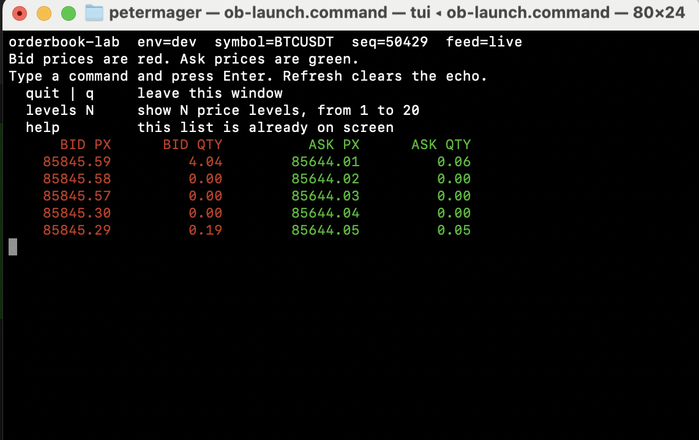

# orderbook-lab

A small, readable market-data lab: a Python adapter, a C++ feed process, a shared-memory ring, a write-ahead log, and a terminal book.

It is a learning project for systems and low-level programming. It is not a production matching engine, and it cannot place orders.

**GitHub:** https://github.com/Chanta007/orderbook-lab



The picture is the dev window on a Mac, fed by Binance's public BTCUSDT top-of-book stream. Bid prices are red. Ask prices are green. The top line shows the environment, the symbol, the sequence, and whether the feed is `live` or `stalled`. This still was taken while an older build was still keeping prices from earlier pictures, so some bids sit above the asks. The current code replaces each picture, so those old prices do not remain. The layout, the colors, and the on-screen commands are what the window shows.

## What this is for

I built this to show the kind of work I want to do in an internship: take a real data feed, put a clear boundary between processes, and make the failure modes visible.

The interesting parts are not a framework. They are the choices underneath a short program:

- Two languages, one binary message. Python speaks to the exchange. C++ owns the hot path. They meet on TCP at `127.0.0.1:9001` with a packed 72-byte `Msg`.
- Processes, not one big loop. The adapter, `feedd`, and the terminal each have their own lifetime. The terminal can keep drawing after the socket drops. That bug is why the window now says `stalled` and the adapter reconnects.
- Shared memory with a cursor per reader. The ring is an `mmap` file. The terminal and the headless checker do not steal each other's place in the stream.
- A write-ahead log beside the ring, replayable with `Wal::replay`. Trace ids travel inside the message. The log line is formatted on a side thread, not on the thread that publishes.
- A websocket client written against the spec. Client frames are masked. A pong copies the ping payload. Binance's spot stream closes the connection if that pong does not come back.
- The stream is `btcusdt@depth5@100ms`. That is a fresh top-5 picture, not a diff. Each picture clears that side of the book before the new prices are inserted. Treating it as a diff is what left old bids on the screen.
- Dev cannot send orders. `allow_orders` must stay false, the adapter refuses trade URLs, and prod refuses to start unless `ORDERBOOK_ALLOW_PROD=1`.
- Tests do not need a network. `make test` checks the book, the ring, the log, and the masked websocket frame. `make e2e` replays `e2e/fixture.jsonl` through the same processes.

## Run it

You need a C++17 compiler, `make`, and `python3`. No pip packages.

```bash
make test
make e2e

python3 python/obctl.py setup --config config/dev.json
python3 python/obctl.py start --config config/dev.json --tui
python3 python/obctl.py stop  --config config/dev.json
```

`make setup`, `make start`, and `make stop` are the same three commands. Run them from the repository root. `make` looks for `./Makefile`, so a shell sitting in `config/` will not find it.

In the window, type a command and press Enter. The picture refreshes ten times a second, so the letters you type may not stay visible.

| Command | What it does |
|---------|----------------|
| `quit` or `q` | Leave the window. The feed keeps running until `obctl stop`. |
| `levels N` | Show 1 to 20 price levels. |
| `help` | The list is already on the screen. |

`feed=stalled` means no new message has arrived for about two seconds. The adapter reconnects on its own. The book stays on the last update until the next picture arrives.

The live socket is market-data only:

`wss://data-stream.binance.vision/ws/btcusdt@depth5@100ms`

There is no API key. That host cannot place an order. `make e2e` does not open it. It plays `e2e/fixture.jsonl` instead.

## Dev and prod

| | dev | prod |
|--|-----|------|
| Config | `config/dev.json` | `config/prod.json` |
| Data | `var/dev` | `var/prod` |
| Listen | `127.0.0.1:9001` | `127.0.0.1:9101` |
| Orders | `allow_orders` must be false | still false unless you change the file and set `ORDERBOOK_ALLOW_PROD=1` |

`obctl` refuses to start prod without that environment variable. The dev file is rejected if `allow_orders` is true.

`dev` on GitHub is the integration branch. `main` is the release branch. Feature work belongs on `feature/*`.

## How the pieces connect

```
Binance public websocket, or e2e/fixture.jsonl
        |
  python/feed_adapter.py     stdlib only, no pip
        |  TCP, 72-byte Msg
  src/feedd.cpp              accept loop, mmap ring, WAL, async log
        |
  src/tui.cpp                the window in the picture
  src/headless.cpp           counts for make e2e
  tests/test_core.cpp        ring, book, WAL, snapshot replace
```

| Path | Role |
|------|------|
| `include/ob/msg.hpp` | Packed message. `Depth` updates one price. `DepthReset` clears one side. Size stays 72 bytes. |
| `include/ob/ring.hpp` | `mmap` ring. Each reader keeps its own cursor. |
| `include/ob/book.hpp` | Bids and asks. A reset drops prices that are no longer in the picture. |
| `include/ob/wal.hpp` | Append-only log. Replay reads it back. |
| `include/ob/trace.hpp` | 16-byte trace id and 8-byte span id. Logging is off the publish thread. |
| `python/obctl.py` | `setup`, `start`, `stop` from a config file. |
| `python/feed_adapter.py` | Websocket or fixture file to TCP. |
| `python/test_ws_frames.py` | Mask bit, pong payload, and the reset at the start of a picture. |

A CMake file can build the same binaries. `make` and GitHub Actions (`.github/workflows/ci.yml`) are the path that actually runs the tests. CI is `ubuntu-latest`, installs `g++`, `make`, and `python3`, then runs `make test` and `make e2e`.

## What I would walk through in an interview

1. Why the adapter is a separate process, and what breaks if it dies while the terminal is still open.
2. Why a client websocket frame has to be masked, and why an empty unmasked pong is enough for Binance to hang up.
3. Why `@depth5@100ms` must replace the side instead of merging forever. The picture at the top is the before case.
4. Why prod is a different port, a different directory, and a refused start, instead of a comment that says "be careful".
5. How `make e2e` checks the same path as the live window without using the network.

## What this is not

- Not a matching engine, and not a trading bot.
- Not a claim about latency. Nothing here is benchmarked against a commercial feed handler.
- Not Kafka, Redis, or the OpenTelemetry C++ SDK. Those were considered and left out so the lab still builds with a compiler and `python3`.
- Not a full order-book diff feed. The subscription is the top of book only.

## Layout

```
include/ob/    message, ring, book, WAL, config, trace
src/           feedd, tui, headless
python/        obctl, feed adapter, frame tests
config/        dev.json, prod.json
e2e/           fixture.jsonl
docs/images/   the window at the top of this file
.github/       CI
```
